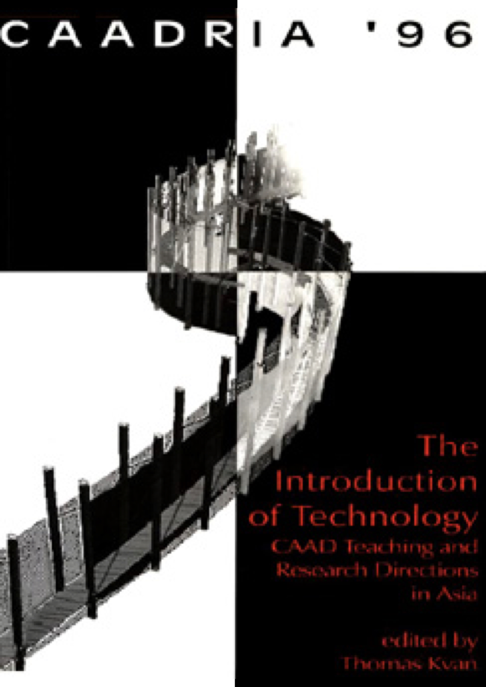

# The Introduction of Technology: CAAD Teaching and Research Directions in Asia

### Conference Organisation
HKU Department of Architecture, The University of Hong Kong, Hong Kong

### Conference Chair
* Thomas KVAN

&rarr; [Find all CAADRIA 1996 papers on CuminCAD](https://cumincad.architexturez.net/documents/series/CAADRIA%20'96)

&rarr; CuminCAD bibliographic information
