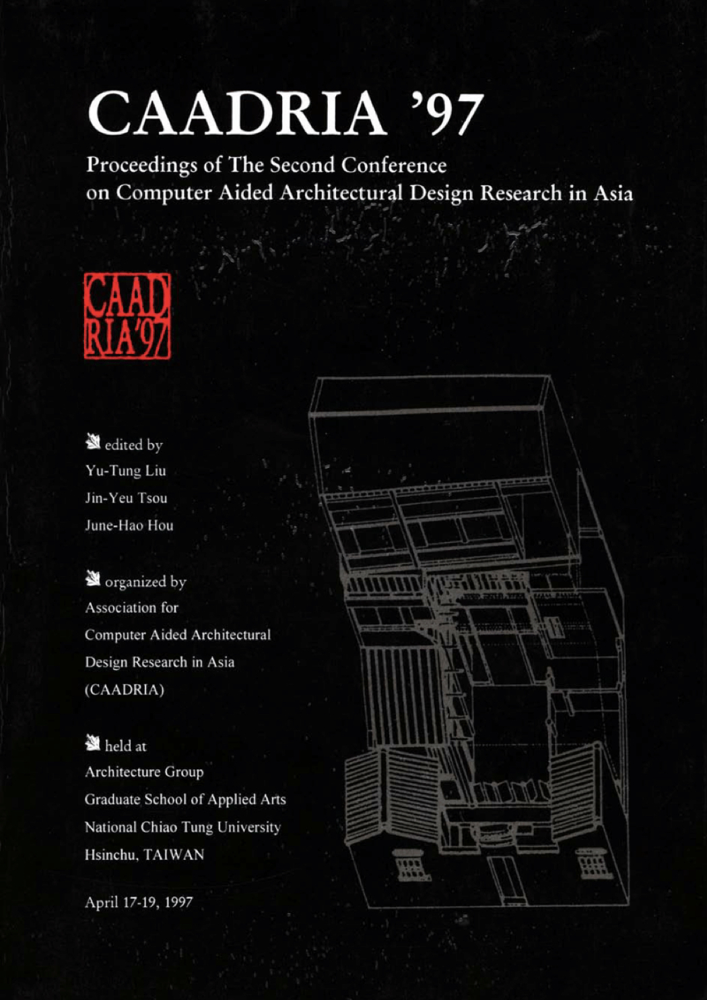

### Conference Organisation
Architecture Group, Graduate School of Applied Arts, National Chiao-Tung University, Hsinchu, Taiwan

### Conference Organizing Committee
* Yu-Tung Liu (Conference Chair)
* Jin-Yeu Tsou (Program Chair)
* June-Hao Hou (Conference Manager)

&rarr; [Find all CAADRIA 1997 papers on CuminCAD](http://papers.cumincad.org/cgi-bin/works/Search?search=series%3ACAADRIA+year%3A1997)

&rarr; CuminCAD bibliographic information
