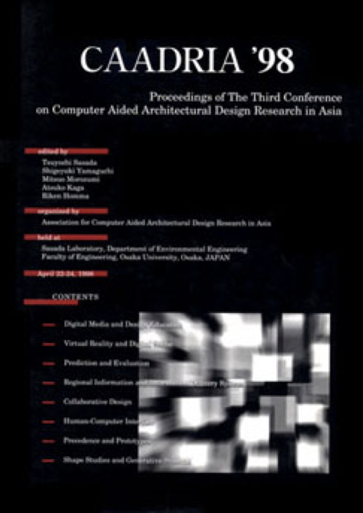

# Learning, Prototyping and Adapting

### Conference Organisation
Sasada Laboratory, Department of Environmental Engineering, Osaka University, Osaka, Japan

### Conference Organizing Committee
* Tsuyoshi Sasada (Conference Chair), Professor, Osaka University, JAPAN
* Shigeyuki Yamaguchi (Conference Vice-Chair), Professor, Kyoto Institute of Technology, JAPAN
* Mitsuo Morozumi (Program Chair), Professor, Kumamoto University, JAPAN
* Atsuko Kaga (Conference Manager), Lecturer, Osaka University & Hankyu Institute of Technology and Culture, JAPAN

&rarr; [Find all CAADRIA 1998 papers on CuminCAD](https://cumincad.architexturez.net/documents/series/CAADRIA%20'98)

&rarr; CuminCAD bibliographic information
