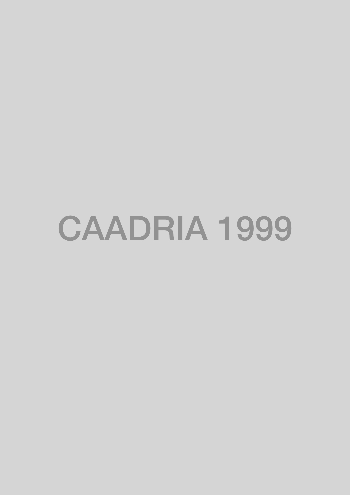

### Conference Organisation
College of Architecture and Urban Planning, Tonji University, Shanghai, China

### Conference Organizing Committee
* Jing-Wen Gu (Conference Chair), Professor, TongJi University, CHINA
* Zhao-Ji Wei (Program Chair), Professor, Southeast University, CHINA
* Zhen-yu Xie (Conference Manager), Lecturer, Tongji University, CHINA
* Jing-ping Qian (Conference Manager), Southeasr University, CHINA

&rarr; [Find all CAADRIA 1999 papers on CuminCAD](https://cumincad.architexturez.net/documents/series/CAADRIA%20'99)

&rarr; CuminCAD bibliographic information
