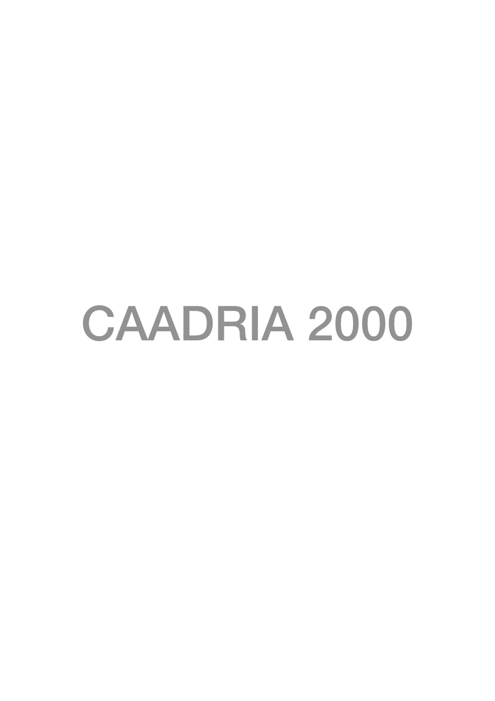

### Conference Organisation
Centre for Advanced Studies in Architecture (CASA) \
School of Architecture \
Faculty of Architecture, Building and Real Estate \
National University of Singapore, Singapore

### Chairman
Milton Tan

### Program Chair
* Tan Beng Kiang
* Wong Yunn Chii
* Joseph Lim
* Hee Li Min
* Li Xiao Dong
* Dorothy Man
* Emily Ong
