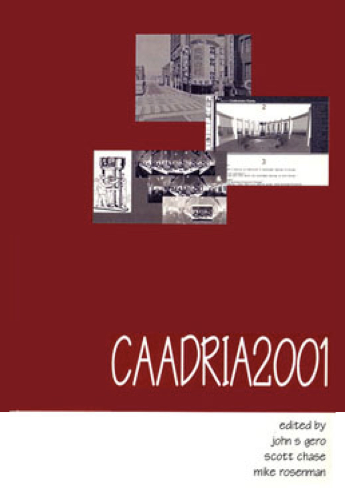

### Conference Organisation
Key Centre of Design Computing and Cognition, Faculty of Architecture, University of Sydney, Sydney, Australia

### Conference Organizing Committee
* Co-Chairs: John Gero, Mike Rosenman, Scott Chase
* Conference Manager: Anne Christian

&rarr; [Find all CAADRIA 2001 papers on CuminCAD](http://papers.cumincad.org/cgi-bin/works/Search?search=series%3ACAADRIA+year%3A2001)

&rarr; CuminCAD bibliographic information
