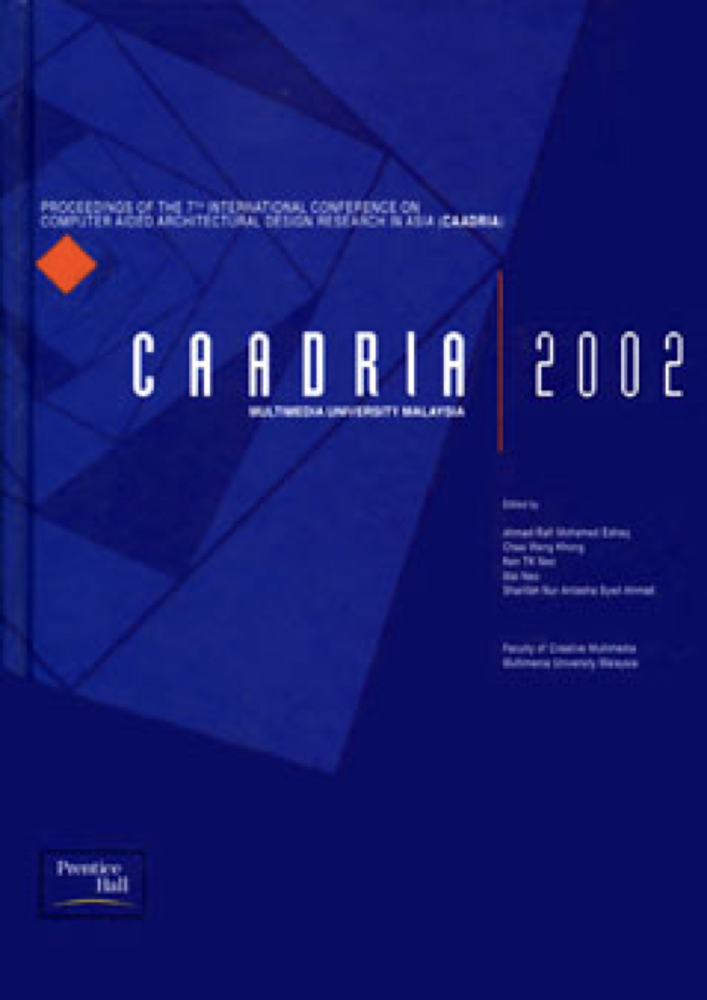

# Redefining Content

### Conference Organisation
Faculty of Creative Multimedia, Multimedia University Malaysia, Cyberjaya, Malaysia

### Conference Organizing Committee
* Ahmad Rafi Mohamed Eshaq (Chair)

&rarr; [Find all CAADRIA 2002 papers on CuminCAD](http://papers.cumincad.org/cgi-bin/works/Search?search=series%3ACAADRIA+year%3A2002)

&rarr; CuminCAD bibliographic information
