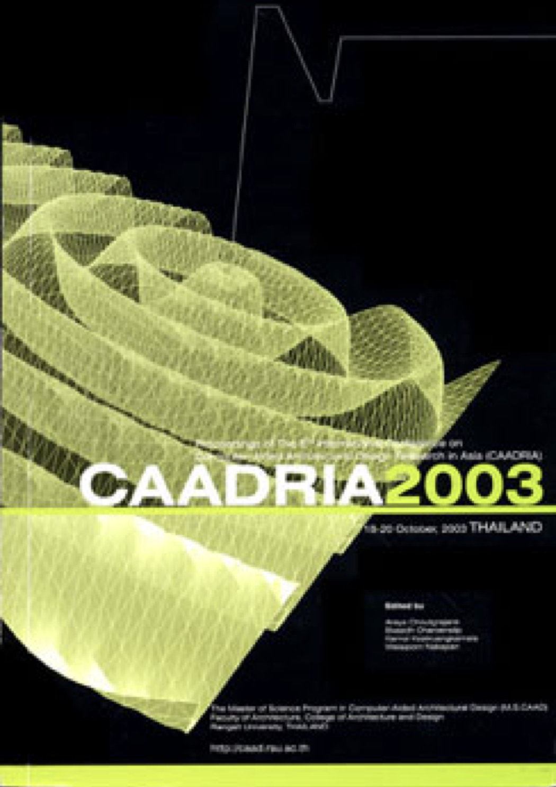

### Conference Organisation:
Rangsit University, Bangkok, Thailand

### Conference Organizing Committee:
* Conference Chair: Araya Choutgrajank
* Conference Manager: Ekasidh Charoensilp
* Conference coordinator: Kamol Keatruangkamala
* Conference Registration: Raktham Sallakachat
* Conference Secretary: Wailaiporn Nakapan

&rarr; [Find all CAADRIA 2003 papers on CuminCAD](http://papers.cumincad.org/cgi-bin/works/Search?search=series%3ACAADRIA+year%3A2003)

&rarr; CuminCAD bibliographic information
