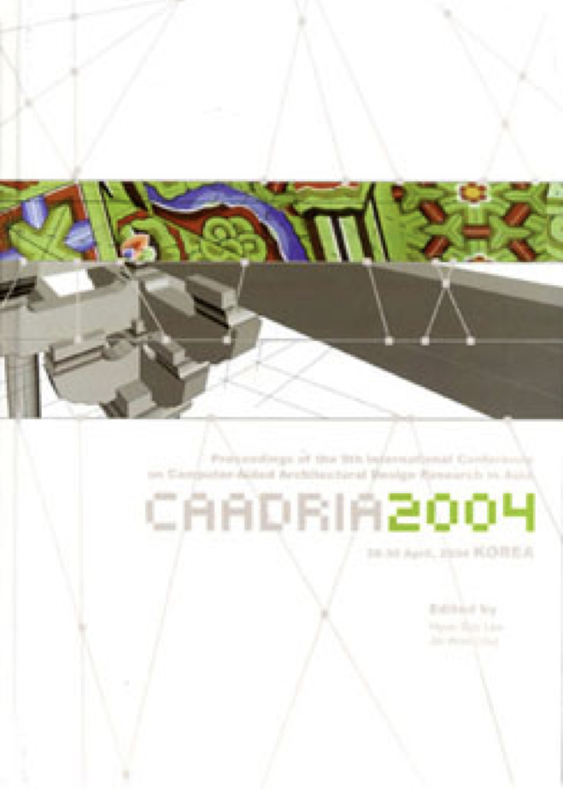

# Culture, Technology and Architecture

### Conference Organisation
* Institute of Millennium Environmental Design and Research, Yonsei University, Seoul, Korea
* The Korean Housing Association

### Conference Chair
* Prof. Hyun Soo Lee

### Program Chair
* Prof. Jin Won Choi

### Event Chair
* Prof. Yeun Sook Lee

### Event Chair
* Prof. Uk Kim

### Exhibition Manager
* Prof. Kun Soo Oh

### Registration& Secretary
* Ms. Jeong Sook Jeon

&rarr; [Find all CAADRIA 2004 papers on CuminCAD](http://papers.cumincad.org/cgi-bin/works/Search?search=series%3ACAADRIA+year%3A2004)

&rarr; CuminCAD bibliographic information
