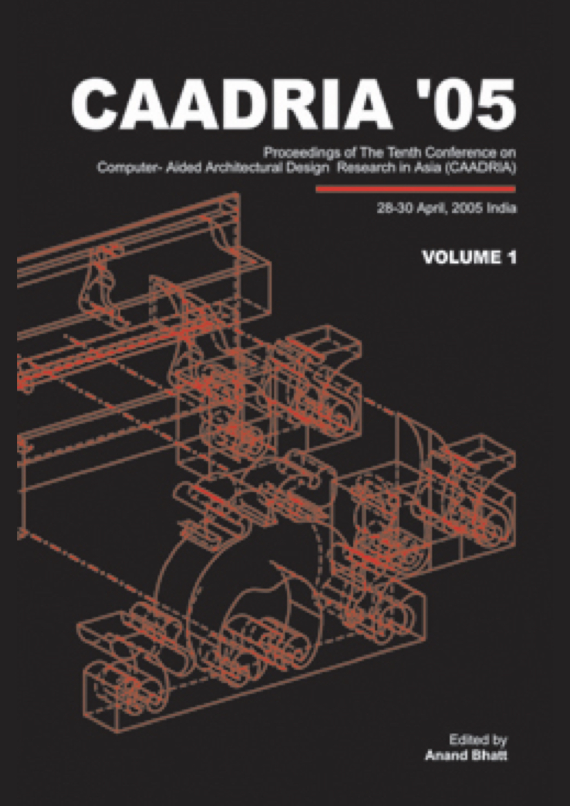

# Digital Opportunities

### Conference Organisation
TVB School of Habitat Studies, New Delhi, India

### Conference Chair:
* Anand BHATT
* AG Krishna MENON, TVB-SHS, New Delhi

### Paper Selection:
* Tom KVAN (Chair, selection committee), The University of Hong Kong

### Executive Officer:
* Nupur PRAKASH , IGIT, New Delhi

### Session Managers:
* Mark WARNER, TVB-SHS, New Delhi
* Peu Banerjee, TVB-SHS, New Delhi

&rarr; [Find all CAADRIA 2005 papers on CuminCAD](http://papers.cumincad.org/cgi-bin/works/Search?search=series%3ACAADRIA+year%3A2005)

&rarr; CuminCAD bibliographic information
