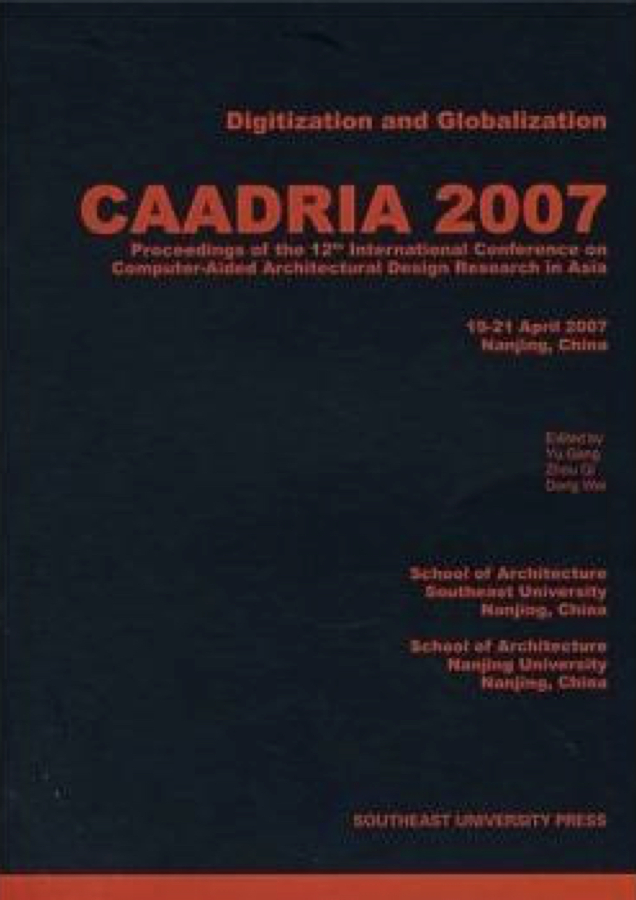

# Digitization and Globalization

### Conference Organisation
Southeast University and Nanjing University, Nanjing, China

### Academic Committee:
* Chan, Chiushui, Iowa State University, U.S.A.
* Dave, Bharat, University of Melbourne, Australia
* Ding, Wowo, Nanjing University, P.R.China
* Dong, Wei, Southeast University, P.R.China
* Hu, Mingxing, Southeast University, P.R.China
* Ji, Guohua, Nanjing University, P.R.China
* Wang, Jianguo, Southeast University, P.R.China
* Wei, Zhaoji, Southeast University, P.R.China
* Zhou, Qi, Southeast University, P.R.China

### Conference Chair:
* Dong, Wei, Southeast University, P.R.China
* Zhou, Qi, Southeast University, P.R.China

### Program Chair:
* Peng, Ji, Southeast University, P.R.China
* Yu, Gang, Southeast University, P.R.China

### Paper Selection:
* Marc Schanbel
* Tom Kvan
* Maolin Chiu

### Executive Officer:
* Du, Rong, Southeast University, P.R.China
* Li, Dehui, Southeast University, P.R.China
* Qing, Jingping, Southeast University, P.R.China
* Zhang, Jun, Southeast University, P.R.China

&rarr; [Find all CAADRIA 2007 papers on CuminCAD](http://papers.cumincad.org/cgi-bin/works/Search?search=series%3ACAADRIA+year%3A2007)

&rarr; CuminCAD bibliographic information
