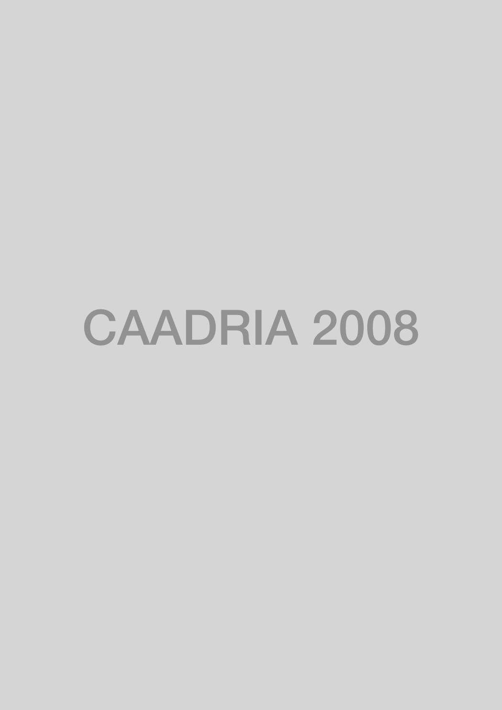

# Beyond Computer-Aided Design

### Conference Organisation
Faculty of Archiecture, Chiang Mai University, Chaiang Mai, Thailand

### Academic Committee:
* Associate Professor Dr. Sombat Thiratrakoolchai
* Assistant Professor Channarong Srisuwan
* Dr. Sant Suwatcharapinun
* Dr. Sethapong Sethabouppha
* Dr. Apichoke Lekagul
* Thaweesak Kaetivirasak
* Piyaboon Nilkaew
* Yuttana Tongtuam
* Kawin Wongwigkarn
* Komson Teeraparbwong
* Somsri Ruksilpakit
* Sumana Parinyaphariwat

### Conference Committee:
* Dr. Ekkachai Mahaek
* Dr. Sant Suwatcharapinun
* Dr. Sethapong Sethabouppha
* Dr. Nawit Ongsavangchai
* Dr. Apichoke Lekagul
* Thaweesak Kaetivirasak
* Piyaboon Nilkaew
* Komson Teeraparbwong
* Somchai Booranarungruangkit
* Yuttana Tongtuam
* Anott Kitnukul
* Rattha Littisorn
* Sathapana Kittikul
* Ronawee Suwantamalee
* Pat Sriaroon
* Waraporn Laoratananuruk
* Sureewan Jansawang
* Wassana Seetavai
* Maytinee Kapkrew
* Vipada Suparatpreecha
* Nilawan Wongsinlapamorakot
* Nirun Sroikum
* Anupong Hutawarakorn
* Surachai Singhtoraj
* Nettaya Chanphen
* Nittaya Kuntana

### Paper Selection Committee:
* Taysheng JENG, National Cheng-Kung University
* Ji-Hyun LEE, Korea Advanced Institute of Science & Technology
* Ekkachai MAHAEK, Chiang Mai University
* Marc Aurel SCHNABEL, University of Sydney

&rarr; [Find all CAADRIA 2008 papers on CuminCAD](http://papers.cumincad.org/cgi-bin/works/Search?search=series%3ACAADRIA+year%3A2008)

&rarr; CuminCAD bibliographic information
