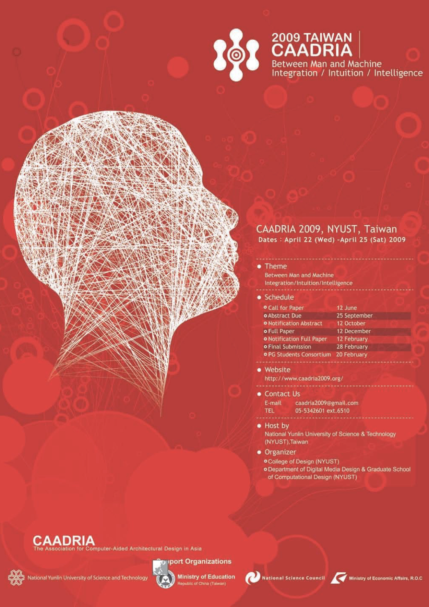

# Between Man and Machine? Integration, Intuition, Intelligence

### Conference Organisation
Department of Digital Media Design and Graduate School of Computational Design, National Yunlin University of
Science and Technology, Yunlin, Taiwan

### Academic Committee:
* Shang-Chia Chiou
* Shing-Sheng Guan
* Chang-Franw Lee
* Alan Chiu
* Teng-Wen Chang

### Conference Committee:
* Jen Yen
* Chang-Franw Lee
* Deng-Chuan Ca
* Lee Ku
* Ming-Mao Lai
* Shyh-Huei Hwang
* Ching Yang
* Yao-Rong Hwang
* Chih-Kao Nieh
* Chao-Ming Wang
* Kuo-Kuang Fan
* Yu-Cheng Chuang
* Li-Shu Lu
* Ko-Tsung Huang
* Cha-Lin Liu
* Shih-Chang Chen
* Szu-Tsung Chen
* Wen-Shan Chang
* Yen-Ming Huang

### Paper Selection Committee:
* Teng-Wen Chang, NYUST, Taiwan
* Sheng-Fen Nik Chien, National Cheng-Kung University, Taiwan
* Erik Champion, Massey University, New Zealand
* Shang-Chia Chiou, NYUST, Taiwan

&rarr; [Find all CAADRIA 2009 papers on CuminCAD](http://papers.cumincad.org/cgi-bin/works/Search?search=series%3ACAADRIA+year%3A2009)

&rarr; CuminCAD bibliographic information
