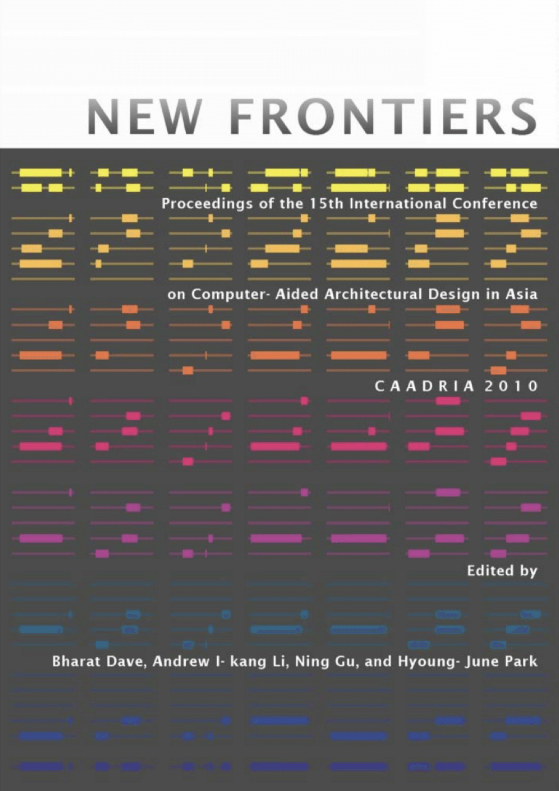

# New Frontiers

### Conference Organisation:
The School of Architecture & Institute of Space & Earth Information Science at the Chinese University of Hong Kong, Hong Kong

### Conference Committee:
* Prof. Marc Aurel Schnabel (School of Architecture, CUHK): Chair
* Prof. Andrew Li (School of Architecture, CUHK)
* Prof. Thomas Fischer (Institute of Creative Industry Design, NCKU)
* Dr. Christiane Herr (Department of Architecture, NCKU)
* Mr. Jason Carlow (Department of Architecture, HKU)
* Prof Jin-Yen Tsou (ISEIS, CUHK): Conference Senior Advisor
* Ms. Christine Ko (School of Architecture, CUHK): Executive Assistant

### Paper Selection:
* Prof. Bharat Dave (University of Melbourne): Chair
* Dr. Ning Gu (University of Newcastle)
* Dr. Hyoung-June Park (University of Hawai'i at Manoa)
* Prof. Andrew Li (Chinese University of Hong Kong)

### Postgraduate Student Consortium:
* Prof. Thomas Fischer (Institute of Creative Industry Design, NCKU)
* Dr. Christiane Herr (Department of Architecture, NCKU)

&rarr; Find all CAADRIA 2010 papers on CuminCAD

&rarr; CuminCAD bibliographic information
