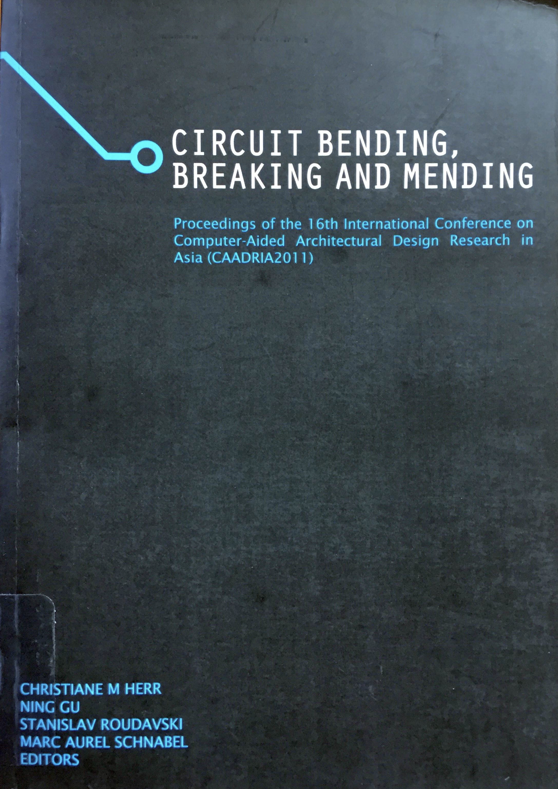

# Circuit Bending, Breaking and Mending

### Conference Organisation
School of Architecture and Built Environment, University of Newcastle, Newcastle, Australia

### Conference Committee:
* Dr. Ning Gu (Chair)
* Josephine Vaughan (Co-chair)
* Professor Michael Ostwald
* Associate Professor Anthony Williams
* Dr. Juhyun Lee

### Paper Selection:
* Dr. Christiane M Herr (Chair), National Cheng Kung University, Taiwan
* Dr. Ning Gu, University of Newcastle, Australia
* Dr. Stanislav Roudavski, University of Melbourne, Australia
* Associate Professor Marc Aurel Schnabel, Chinese University of Hong Kong, Hong Kong

### Postgraduate Student Consortium:
* Prof. Thomas Fischer (Institute of Creative Industry Design, NCKU)
* Dr. Christiane Herr (Department of Architecture, NCKU)

&rarr; [Find all CAADRIA 2011 papers on CuminCAD](http://papers.cumincad.org/cgi-bin/works/Search?search=series%3ACAADRIA+year%3A2011)

&rarr; CuminCAD bibliographic information
