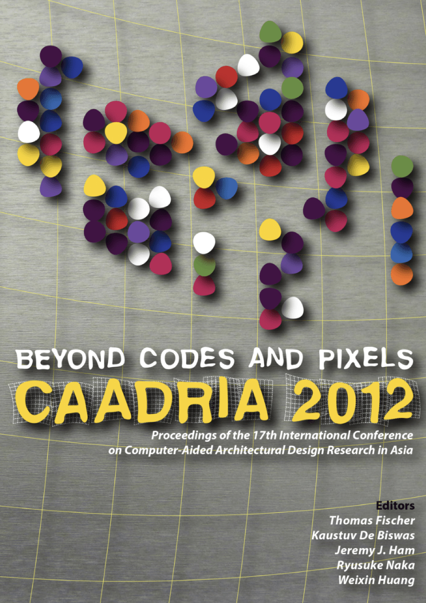

# Beyond Codes and Pixels

### Conference Organisation
School of Architecture, Hindustan Institute of Technology & Science, Chennai, India

### Conference Steering Committee
* Dr. Elizabeth Verghese (Chancellor, Hindustan University)
* Mr. Anand Jacob Verghese (Pro-Chancellor, Hindustan University)
* Dr. K. Sarukesi (Vice-Chancellor, Hindustan University)

### Conference Organizing Committee:
* Mrs.Sheeba Chander (School of Architecture, Hindustan University): Conference Chair
* Mrs.Devyani Gangoadhyay (School of Architecture, Hindustan University): Convenor
* Mr.L.Sathish (School of Architecture, Hindustan University): Co-Convener
* Mr.R.Balaji (School of Architecture, Hindustan University), Executive Co-ordinator

### Paper Selection Committee:
* Prof. Thomas Fischer (Xi'an Jiaotong-Liverpool University, China): Chair
* Dr. Kaustuv De Biswas (Massachusetts Institute of Technology, USA)
* Jeremy J Ham (Deakin University, Australia)
* Prof. Ryusuke Naka (Kyoto Institute of Technology, Japan)
* Prof. Huang Weixin (Tsinghua University, China)

### Postgraduate Student Consortium:
* Prof. Thomas Fischer (Xi'an Jiaotong-Liverpool University, China)
* Dr. Christiane Herr (Xi'an Jiaotong-Liverpool University, China)

&rarr; [Find all CAADRIA 2012 papers on CuminCAD](http://papers.cumincad.org/cgi-bin/works/Search?search=series%3ACAADRIA+year%3A2012)

&rarr; CuminCAD bibliographic information
