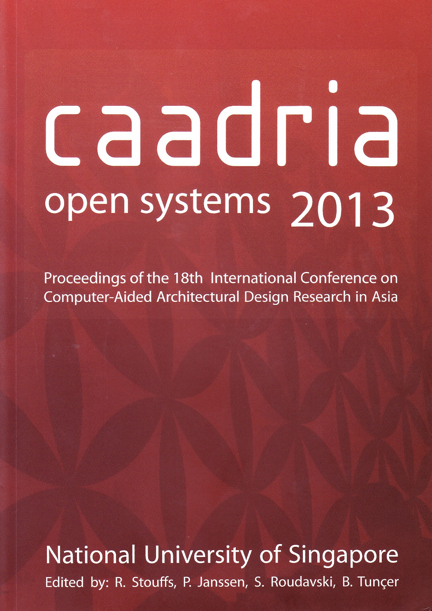

# Open Systems

### Conference Organisation:
Department of Architecture, National University Singapore, Singapore

### Conference Organizing Committee:
* Conference Chair : Tan Beng Kiang
* Vice Chair : Patrick Janssen
* Rudi Stouffs
* Shinya Okuda
* Huang Yi Chun
* Dorothy Man Mei Ling
* Katherine Chong

### Paper Selection Committee:
* Chair : Rudi Stouffs (National University of Singapore, Delft University of Technology)
* Patrick Janssen (National University of Singapore)
* Stanislav Roudavski (The University of Melbourne)
* Bige Tuncer (Singapore University of Technology and Design, Delft University of Technology)

### Postgraduate Student Consortium:
* Sheng-Fen Nik Chien (Chair)
* Ji-Hyun Lee
* Andrew Li

&rarr; [Find all CAADRIA 2013 papers on CuminCAD](ttp://papers.cumincad.org/cgi-bin/works/Search?search=series%3ACAADRIA+year%3A2013)

&rarr; CuminCAD bibliographic information
