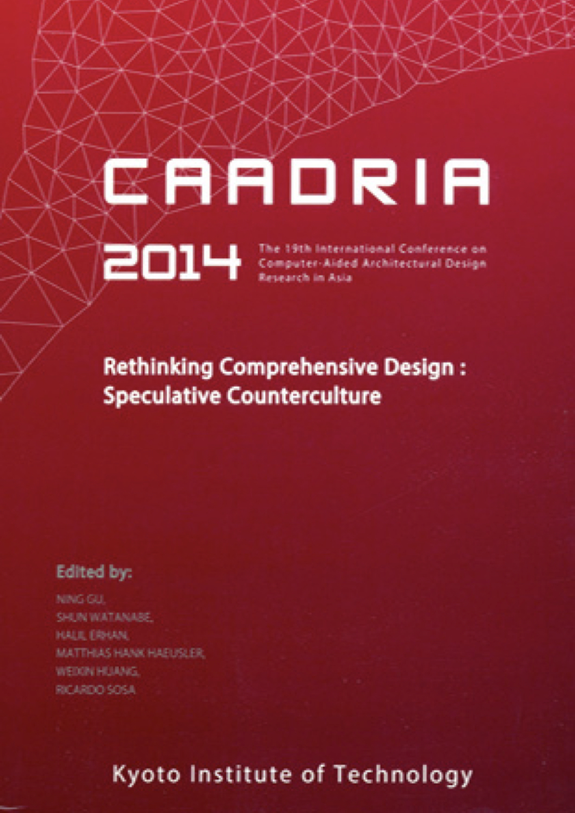

# Rethinking Comprehensive Design: Speculative Counterculture

### Conference Organisation:
Department of Design, Engineering & Management, Kyoto Institute of Technology, Kyoto, Japan

### Conference Organizing Committee:
* Conference Chair : Ryusuke Naka (Kyoto Institute of Technology)
* Akira Wakita (Keio University)
* Atsuko Kaga (Osaka University)
* Atsushi Takizawa (Osaka City University)
* Hideyuki Ishisone (FM System, Inc.)
* Koji Izato (Taisei Coorporation)
* Masanori Nagashima (Informatix Inc.)
* Naomi Matsunaga (Lemon Gasui Ltd., Japan)
* Narito Kurata (Kajima Corporation)
* Ryota Ieiri (Ieiri labo, Inc.)
* Shuichi Asayama (Tokyo Denki University)
* Shun Watanabe (Tsukuba University)
* Tomohiro Fukuda (Osaka University)
* Yasunobu Onishi (Kumamoto University)
* Yasushi Ikeda (Keio University)
* Yuji Matsumoto (Kyoto Institute of Technology)
* Yusuke Obuchi (Tokyo University)

### Paper Selection Committee:
* Chair : Ning GU (University of Newcastle)
* Halil ERHAN (Simon Fraser University)
* Hank HAEUSLER (The University of New South Wales)
* Ricardo SOSA (Singapore University of Technology and Design)
* Shun WATANABE (Tsukuba University)
* Weixin HUANG (Tsinghua University)

### Postgraduate Student Consortium:
* Sheng-Fen Nik Chien (Chair)
* Ji-Hyun Lee
* Andrew Li
* Erik Champion
* Dagmar Reinhardt

&rarr; Find all CAADRIA 2014 papers on CuminCAD

&rarr; CuminCAD bibliographic information
