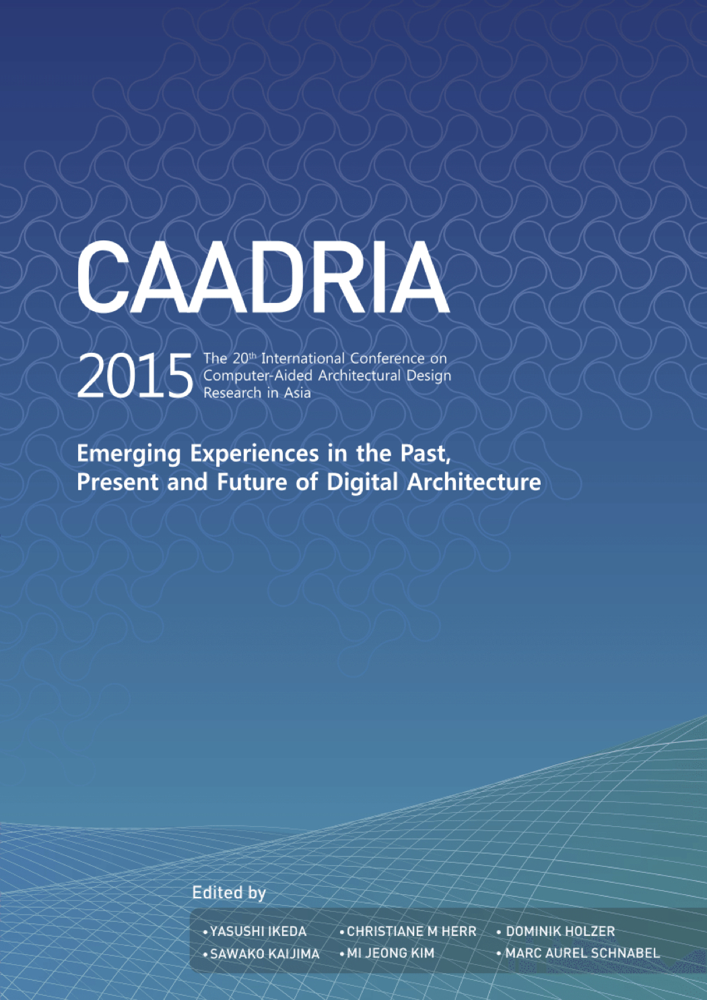

# Emerging Experiences in the Past, Present and Future of Digital Architecture

### Conference Organisation:
Kyungpook National University, Daegu, Korea

### Conference Organizing Committee:
* Hyunsoo LEE, Yonsei University (Chair)
* Seungyeon CHOO, Kyungpook National University (Co-chair)
* Se Yun AN, Hanbat National University
* Myung Yeol CHA, Pai Chai University
* Joong Hyun CHOI, Woosong University
* Seung Hoon HAN, Chonnam National University
* Seung Wan HONG, Inha University
* Chulho HWANG, Designcamp Moonpark
* Gyu Yeob JUN, Jeju National University
* Han-Jong JUN, Hanyang University
* Juyeon KIM, Soongsil University
* Mi Jeong KIM, Kyung Hee University
* Sung Ah KIM, Sungkyunkwan University
* Mijung KOO, Yonsei University
* Ji-Hyun LEE, Korea Advanced Institute of Science and Technology
* Jin Kook LEE, Hanyang University
* Woo Hyeong LEE, Namseoul University
* Kun Soo OH, Namseoul University
* Jung-Dae PARK, Kyonggi University
* Soo Hoon PARK, Hanbat National University
* Jae Ho RYU, Seoul National University of Science & Technology
* Jeongwon Ryu, Sun Moon University
* Kyuman SONG, Hongik University
* Seung-Hak WOO, Kyungpook National University
* Sung Ho WOO, Sookmyung Women's University
* Chang-Gyoon YOO, Mokpo National University
* Ki Byung YOON, Wonkwang University
* -------- Daegu Local Committee --------
* Dong Joon AHN, Kumoh National Institute of Technology
* Ho Soon CHOI, Keimyung University
* Yo Jin CHOI, Catholic University of Daegu
* Young Oh CHOI, Yeungnam University College
* Sung Jo KIM, Daegu Haany University
* Sang Min PARK, Yeungnam University
* Sungjun PARK, Keimyung University
* Cheol-Jae YOON, Kyungpook National University

### Paper Selection Committee:
* Yasushi IKEDA, Keio University, Japan (Chair)
* Christiane M HERR, Xi'an Jiaotong-Liverpool University, China
* Dominik HOLZER, RMIT, Australia
* Sawako KAIJIMA, Singapore University of Technology and Design, Singapore
* Mi Jeong KIM, Kyung Hee University, Korea
* Marc Aurel SCHNABEL, The Chinese University of Hong Kong, China

### Postgraduate Student Consortium:
* Andrew LI, Kyoto Institute of Technology (Chair)
* Jin Kook LEE, Hanyang University

&rarr; Find all CAADRIA 2015 papers on CuminCAD

&rarr; CuminCAD bibliographic information
