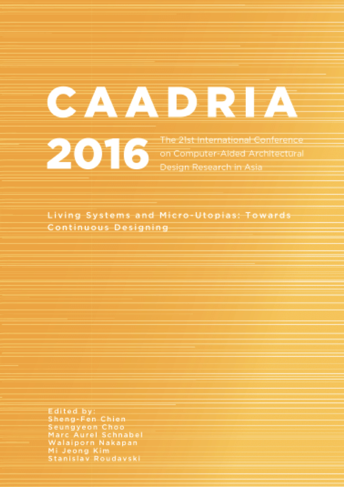

# Living Systems and Micro-Utopias: Towards Continuous Designing

### Conference Organisation:
The University of Melbourne, Melbourne, Australia

### Conference Organizing Committee:
* Dr. Dominik Holzer (UoM)
* Dr. Stanislav Roudavski (UoM)
* Paul Loh (UoM)
* Dr. Jane Burry (RMIT/SIAL)

### Paper Selection Committee:
* Nik Sheng-Fen Chien (Taiwan), Chair
* Seungyeon Choo (Korea)
* Mark Aurel Schnabel (New Zealand)
* Walaiporn Nakapan (Thailand)
* Mi Jeong Kim (Korea)
* Stanislav Roudavsk (Australia)

### Postgraduate Student Consortium:
* Andrew LI, Kyoto Institute of Technology (Chair)
* Ajibade Aibinu (Australia)

&rarr; Find all CAADRIA 2016 papers on CuminCAD

&rarr; CuminCAD bibliographic information
