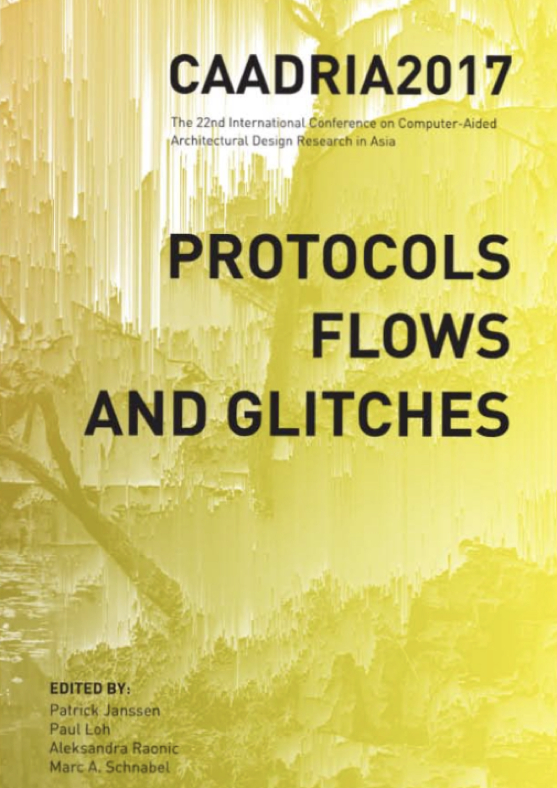

# Protocols, Flows and Glitches

### Conference Organisation:
XI'AN JIAOTONG-LIVERPOOL UNIVERSITY, SUZHOU, CHINA

### Conference Organizing Committee:
* Christiane M. Herr, Chair
* Thomas Fischer
* Aleksandra Raonic
* Glen Wash
* Claudia Westermann
* Cheng Zhang

### Paper Selection Committee:
* Patrick Janssen (Singapore), Chair
* Paul Loh (Australia)
* Aleksandra Raonic (China)
* Marc A. Schnabel (New Zealand)

### Postgraduate Student Consortium:
* Andrew Li (Japan), Chair

&rarr; [Find all CAADRIA 2017 papers on CuminCAD](http://papers.cumincad.org/cgi-bin/works/Search?search=series%3ACAADRIA+year%3A2017)

&rarr; CuminCAD bibliographic information
