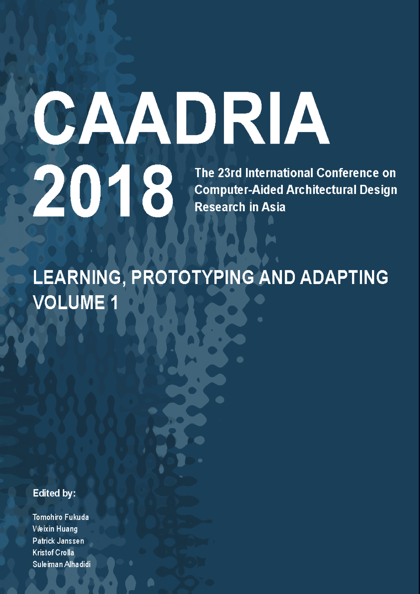

# Learning, Prototyping and Adapting

### Conference Organisation
School of Architecture, Tsinghua University & DADA, Beijing, China

### Conference Organizing Committee
* Weiguo Xu (Chair)
* Weixin Huang
* Yuguang Liu
* Yufang Zhou Feng Xu
* Lei Yu

### Paper Selection Committee
* Tomohiro Fukuda, Chair (Japan)
* Weixin Huang (China)
* Patrick Janssen (Singapore)
* Sawako Kaijima (Singapore)
* Kristof Crolla (Hong Kong)

### Short Paper Selection Committee
* Weixin Huang, Chair (China)
* Mani Williams (Australia)
* Dan Luo (China)
* YiXin Wu (Taiwan)

### Postgraduate Student Consortium
* Dagmar Reinhardt, Chair (Australia)

&rarr; [Find all CAADRIA 2018 papers on CuminCAD](http://papers.cumincad.org/cgi-bin/works/Search?search=series%3ACAADRIA+year%3A2018)

&rarr; CuminCAD bibliographic information
