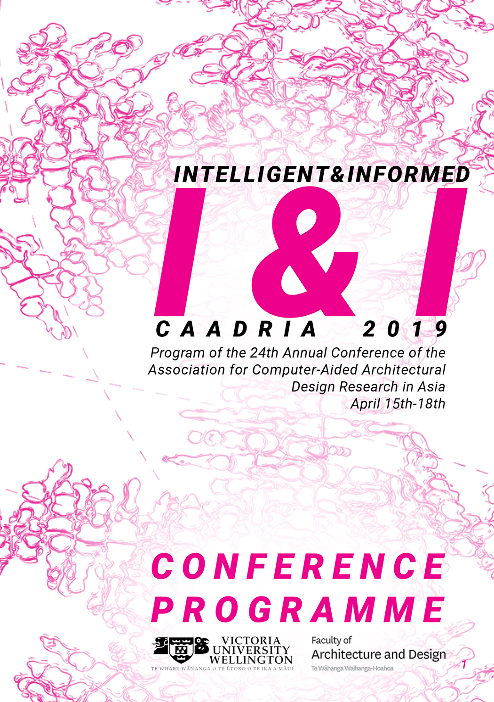

# Intelligent & Informed

### Conference Organisation
Faculty of Architecture & Design, Victoria University of Wellington, Wellington, New Zealand

### Conference Organizing Committee
* Andre Brown
* Marc Aurel Schnabel, Chair
* Tane Moleta
* Jessie Rogers
* Tina Le Phan
* David Silcock
* Austin D'Souza
* Yingge Schnabel
* Chiara Shim
* Hannah Rushton
* Iman Sayah
* Kirstin Va'a
* Sarah Lanigan
* Mark Shaw
* Paul Hillier
* Tim Miller

### Paper Selection Committee
* Matthias Hank Haeusler, Chair (Australia)
* Marc Aurel Schnabel (New Zealand)
* Tomohiro Fukuda (Japan)
* Gabriel Wurzer

### Postgraduate Student Consortium
* Christiane Herr, Chair (China)
* Dagmar Reinhard (Australia)
* Rudi Stouffs (Singapore)

&rarr; [Find all CAADRIA 2019 papers on CuminCAD](http://papers.cumincad.org/cgi-bin/works/Search?search=series%3ACAADRIA+year%3A2019)

&rarr; CuminCAD bibliographic information
