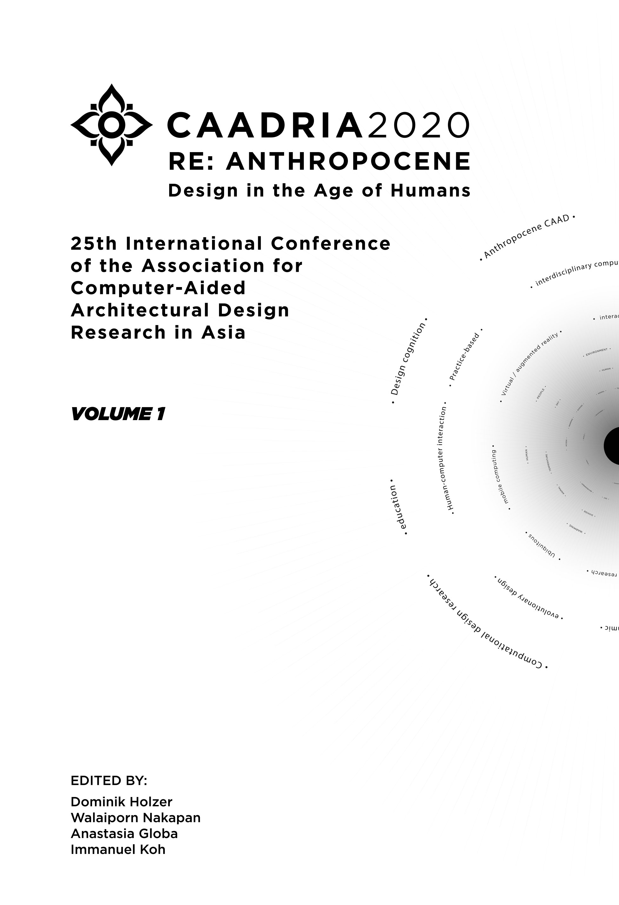

# Intelligent & Informed

### Conference Organisation
Faculty of Architecture, Chulalongkorn University, Bangkok, Thailand

### Conference Organizing Committee
* Surapong Lertsithichai, Chair (Chulalongkorn University)
* Sorachai Kornkasem (Chulalongkorn University)
* Walaiporn Nakapan (Rangsit University)

### Paper Selection Committee
* Dominik Holzer, Chair (Australia)
* Walaiporn Nakapan (Thailand)
* Anastasia Globa (Australia)
* Immanuel Koh (Singapore)

### Postgraduate Student Consortium
* Christiane Herr, Chair (China)
* Dagmar Reinhard (Australia)
* Rudi Stouffs (Singapore)

&rarr; [Find all CAADRIA 2020 papers on CuminCAD](http://papers.cumincad.org/cgi-bin/works/Search?search=series%3ACAADRIA+year%3A2020)

&rarr; CuminCAD bibliographic information

