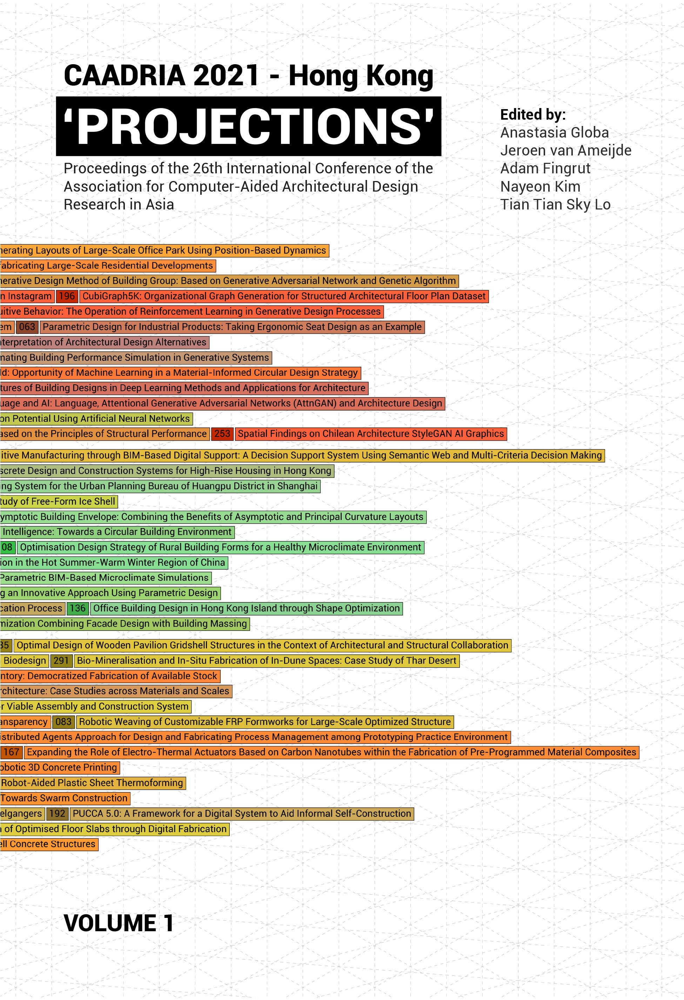

# PROJECTIONS

### Conference Organisation
School of Architecture, The Chinese University of Hong Kong

### Conference Organizing Committee
* Kristof Crolla, Co-Chair (University of Hong Kong)
* Adam Fingrut, Co-Chair (Chinese University of Hong Kong )
* Jeroen van Ameijde, Co-Chair (Chinese University of Hong Kong)
* Donn Holohan (University of Hong Kong)
* Hoi Lam Melody (Chinese University of Hong Kong)
* Goepel Garvin (Chinese University of Hong Kong)
* Lidia Ratoi (University of Hong Kong)

### Paper Selection Committee
* Anastasia Globa, Chair (University of Sydney)
* Jeroen van Ameijde (Chinese University of Hong Kong)
* Adam Fingrut (Chinese University of Hong Kong)
* Nayeon Kim (Yonsei University)
* Tian Tian Sky Lo (Harbin Institute of Technology, Shenzhen) 

### Postgraduate Student Consortium
* Christiane Herr, Chair (China)
* Dagmar Reinhard (Australia)
* Rudi Stouffs (Singapore)

&rarr; [Find all CAADRIA 2021 papers on CuminCAD](http://papers.cumincad.org/cgi-bin/works/Search?search=series%3ACAADRIA+year%3A2021)

&rarr; CuminCAD bibliographic information

